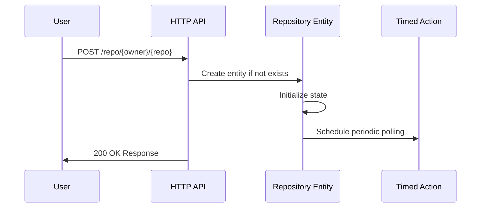
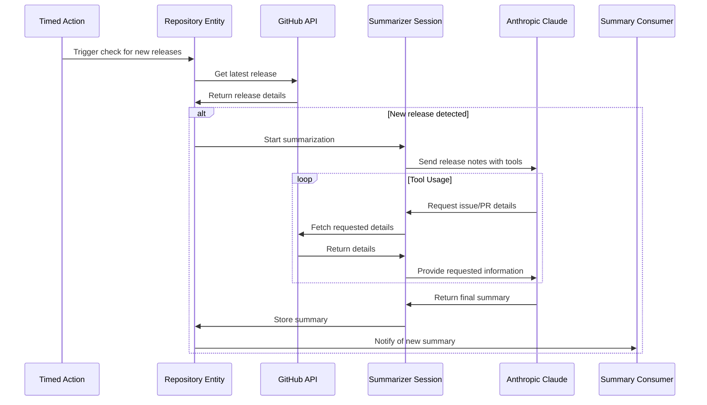
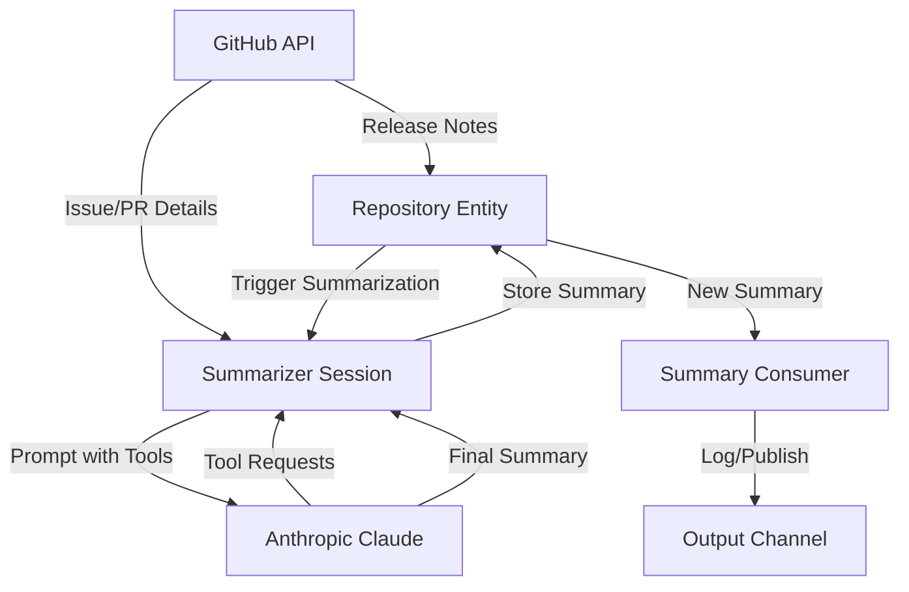

# GitHub changelog summarizer

## What the sample is/does

This showcases an AI assistent implemented with the Akka SDK that observes GitHub releases to automatically summarizes the release contents.

## Design overview

When a repository is added to the service, it creates an event sourced entity representing the repository. A Timed Action 
is set up to poll the GitHub release notes periodically, if it detects a latest release that it has not seen before, 
a summarization session is started using the Anthropic Claude LLM with tools, allowing Claude to request more details 
for issue and pull request ids mentioned in the release notes.

Once the LLM is done creating a summary, the summary is stored for in the repository entity. A consumer listens for summaries
and can act by publishing the summary somewhere (currently it logs it).

The interactions with Anthropic Claude is using the [Anthropic Java SDK](https://github.com/anthropics/anthropic-sdk-java).

## Running the sample

Start local github MCP server

npx -y supergateway --stdio "docker run -i --rm \
  -e GITHUB_PERSONAL_ACCESS_TOKEN=<token> \
  -e GITHUB_READ_ONLY=1 \
  ghcr.io/github/github-mcp-server"

To interact with the Anthropic LLM the environment variables ANTHROPIC_API_KEY and or ANTHROPIC_AUTH_TOKEN must be set
to tokens gotten from the [Anthropic console](https://console.anthropic.com/)

The GitHub API interactions are done anonymously by default, but a default API key can be defined using environment variable
`GITHUB_API_TOKEN` or config `github-api-token` in `application.conf`. Specific API keys can also be specified when a GitHub repository
is added, to use for interactions for that repository.


### Interacting with the sample

Set up a repository for tracking, this will trigger a summary pretty quickly:

A GitHub API access token for the specific repository can be provided through the body JSON field "gitHubApiToken", however
note that providing a key that allows for access to a private repository will pass potentially private information from
the release notes and issues of that project to Anthropic Claude.

```shell
curl http://localhost:9000/repo/akka/akka \
  --header "Content-Type: application/json" \
  -XPOST \
  --data '{}'
```

Fetch generated and stored summaries for a given project
```shell 
curl http://localhost:9000/repo/akka/akka/summaries
```

Trigger a one-off summary of the latest release (can be run without any prior calls). This is useful for playing around
with changes to the prompt:

```shell
curl http://localhost:9000/testing/repo/akka/akka-sdk/summarize-latest \
  -XPOST
```

## System Architecture

### Core Components

#### 1. Repository Entity

- **Event-sourced entity** representing a GitHub repository
- Stores repository metadata and generated summaries
- Manages the state of tracked releases

#### 2. Timed Action Scheduler

- Periodically polls GitHub for new releases
- Triggers summarization when new releases are detected

#### 3. Summarization Session

- Coordinates the interaction with Anthropic Claude LLM
- Provides tools for the LLM to fetch additional information about issues and PRs
- Processes the final summary

#### 4. GitHub API Client

- Handles communication with GitHub's API
- Fetches release notes, issue details, and PR information
- Supports both anonymous and authenticated access

#### 5. Anthropic Client

- Manages communication with Anthropic's Claude LLM
- Sends prompts and processes responses
- Handles tool usage requests from the LLM

#### 6. Summary Consumer

- Listens for newly generated summaries
- Currently logs the summaries (could be extended to publish to other channels)

#### 7. HTTP API

- Exposes endpoints for managing repositories and retrieving summaries
- Includes testing endpoints for triggering one-off summarizations

### LLM Tools Integration

The system leverages Anthropic Claude's function calling capabilities through the following tools:

#### fetchIssueDetails Tool

- **Purpose**: Allows the LLM to request additional context about GitHub issues mentioned in release notes
- **Input**: GitHub issue ID (integer)
- **Output**: Detailed information about the issue, including title, description, labels, and comments
- **Usage**: When release notes contain minimal information about an issue (e.g., just "Fixed #123"), the LLM can use this tool to gather more context for creating a comprehensive summary

The tool integration follows a request-response pattern:
1. Claude identifies an issue needing more context
2. Claude calls the fetchIssueDetails tool with the issue ID
3. The SummarizerSession fetches the details from GitHub
4. The details are returned to Claude for incorporation into the summary

This agentic approach allows the LLM to autonomously decide when additional information is needed, making the summaries more informative and accurate.

### Component Interactions

#### Repository Registration Flow



#### Release Detection and Summarization Flow



### Data Flow



